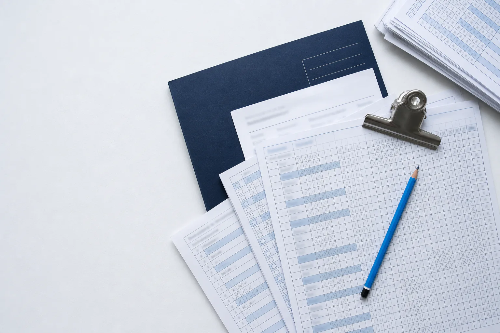
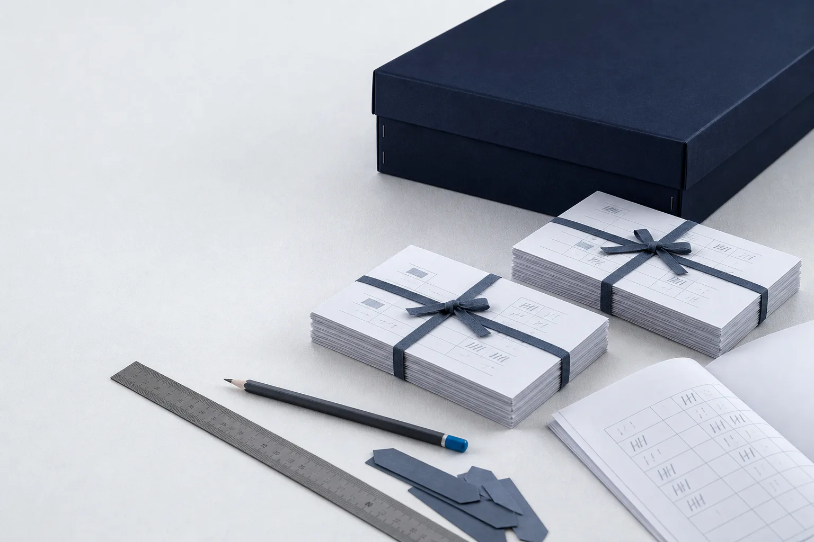
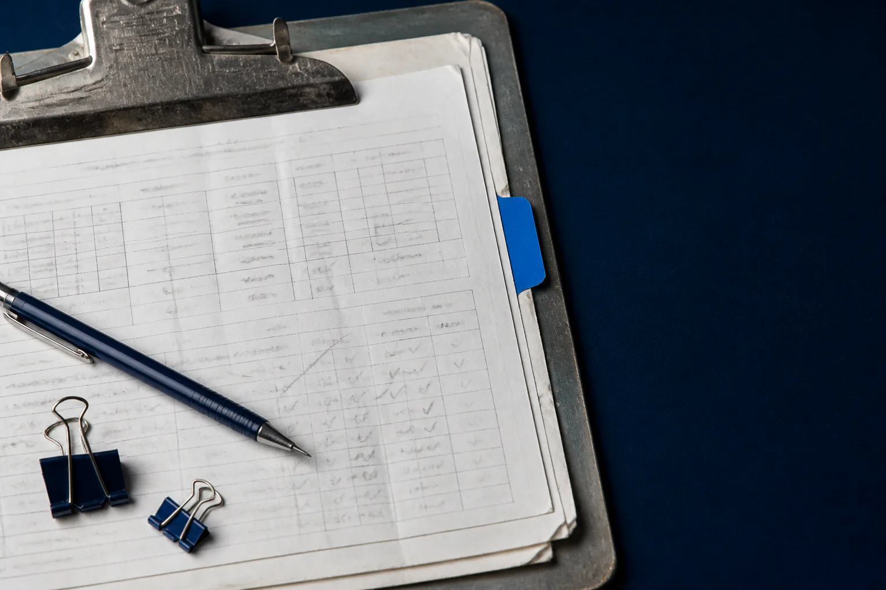
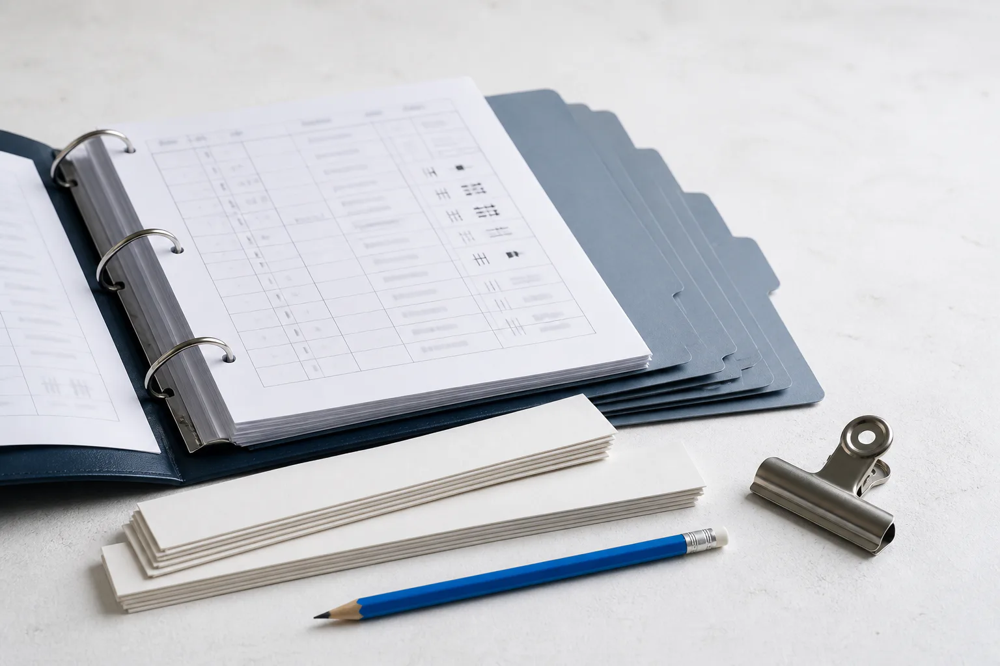

# Homepage imagery candidates

Status: **SELECTION RECORDED — HERO A AND EXPERIENCE A**

Generated: 18 August 2026

These are the standalone homepage production-asset candidates from Task 04. On 18 August 2026, the user selected Hero A and Experience A for the Task 05 homepage build. Every document shown is fictional and intentionally unreadable.

## Hero candidate A — register desk, top-down

**SELECTED BY USER — 18 AUGUST 2026**



- Visual distinction: open, light composition with the operational materials concentrated to the right.
- Intended desktop crop: full 3:2 frame; left third retained as a practical safe area.
- Intended mobile crop: centred 4:3 crop, supplied as `hero-a-mobile-crop.webp`.
- Accessibility description: Overhead view of fictional marked-register sheets, a navy folder, metal clip and blue pencil on an off-white work surface.

| File | Dimensions | Format | Size |
|---|---:|---|---:|
| `hero-a-master.png` | 1536×1024 | PNG master | 2,570,110 bytes |
| `hero-a-preview.webp` | 1536×1024 | WebP, quality 82 | 144,686 bytes |
| `hero-a-mobile-crop.webp` | 768×576 | WebP, quality 80 | 41,770 bytes |

<details>
<summary>Generation prompt</summary>

```text
Use case: photorealistic-natural
Asset type: Political Solutions public homepage hero image candidate A
Primary request: a premium editorial documentary still life of real campaign-work materials on a light operational worktable, showing disciplined preparation and data handling without people
Scene/backdrop: cool off-white (#F5F7FA) matte table surface with subtle paper grain; restrained dossier-like grid discipline
Subject: fictional marked-register sheets and count material with small grid cells and pencil ticks that are intentionally defocused and completely unreadable, a deep navy (#101F36) archival folder, one steel clipboard clip, a blue (#0087DC) pencil, and a short stack of neatly squared paper
Style/medium: photorealistic professional editorial photography, tactile real materials, understated British operational gravitas, natural imperfections, not a stock photo and not an illustration
Composition/framing: wide horizontal 3:2 composition, top-down camera; focal cluster placed in the right two-thirds; generous clean off-white negative space in the upper-left and left third for responsive page copy; keep all essential objects inside the central 70% so a 4:3 mobile crop remains useful
Lighting/mood: soft cool daylight from one side, controlled short shadows, calm, precise, credible
Color palette: only off-white #F5F7FA, navy #101F36, deep navy #0C1729, bright blue #0087DC, slate #5B6C82, muted blue-grey #8DA0B8, hairline grey #E1E7EE, neutral steel
Constraints: no readable names, addresses, postcodes, voter numbers, signatures, dates, party names, or any personal data; no readable words at all; all paperwork must be visibly fictional and unreadable; no politicians; no people or hands; no party logos; no flags; no rosettes; no staged office teams; no laptops; no screens; no product UI; no maps; no gradients; no gold; no green accents; no red accents; no logos; no watermark; no text overlay; no decorative effects; no fabricated interface or chart
```

</details>

## Hero candidate B — count materials, oblique

**NOT SELECTED**



- Visual distinction: lower, more dimensional view centred on a navy archive box and prepared paper bundles.
- Intended desktop crop: full 3:2 frame; left third retained as a practical safe area.
- Intended mobile crop: centred 4:3 crop, supplied as `hero-b-mobile-crop.webp`.
- Accessibility description: Oblique view of a navy archive box, tied bundles of fictional count sheets, ruler, pencil and blank tabs on an off-white work surface.

| File | Dimensions | Format | Size |
|---|---:|---|---:|
| `hero-b-master.png` | 1536×1024 | PNG master | 2,353,945 bytes |
| `hero-b-preview.webp` | 1536×1024 | WebP, quality 82 | 92,700 bytes |
| `hero-b-mobile-crop.webp` | 768×576 | WebP, quality 80 | 23,574 bytes |

<details>
<summary>Generation prompt</summary>

```text
Use case: photorealistic-natural
Asset type: Political Solutions public homepage hero image candidate B
Primary request: a premium editorial photograph of a campaign count preparation table, focused entirely on physical operational materials and disciplined document handling
Scene/backdrop: a pale cool off-white (#F5F7FA) work surface with restrained dossier-like geometry and practical real-world texture
Subject: a closed deep-navy (#0C1729) document box, two neatly tied bundles of fictional count sheets, an unbranded metal ruler, a graphite pencil with a blue (#0087DC) painted end, removable slate-grey index tabs with no writing, and one partly opened sheet showing only faint defocused grid lines and abstract tally marks
Style/medium: photorealistic high-end editorial photography, observational and quiet, materially rich, confident but not luxurious, not an illustration and not a generic office stock image
Composition/framing: wide horizontal 3:2 composition from a shallow 35-degree oblique angle; objects form a crisp diagonal rhythm across the right and lower-middle; preserve generous uncluttered off-white safe area across the left third and upper-left; keep the document box and main paper bundle within the central 65% for a useful 4:3 mobile crop
Lighting/mood: cool diffused window light, subtle controlled shadows, calm operational readiness, precise and credible
Color palette: off-white #F5F7FA, navy #101F36, deep navy #0C1729, blue #0087DC, slate #5B6C82, muted blue-grey #8DA0B8, hairline grey #E1E7EE, neutral graphite and steel only
Constraints: all documents are fictional; no readable words, names, addresses, postcodes, voter numbers, dates, labels, signatures, or personal data; any printed marks must be abstract and unreadable; no politicians; no people; no hands; no party logos; no flags; no rosettes; no staged teams; no laptops; no screens; no product UI; no charts; no maps; no gradients; no gold; no green accents; no red accents; no logos; no watermark; no text overlay; no decorative effects; no fabricated interface
```

</details>

## Experience candidate A — worked clipboard

**SELECTED BY USER — 18 AUGUST 2026**



- Visual distinction: tactile, close and deliberately less pristine, with a deep-navy right-side field.
- Intended desktop crop: full 3:2 frame; right third retained as a practical safe area.
- Intended mobile crop: centred 4:3 crop, supplied as `experience-a-mobile-crop.webp`.
- Accessibility description: Close overhead view of a worn clipboard holding fictional register sheets with a navy pen, binder clips and blue tab on a deep-navy surface.

| File | Dimensions | Format | Size |
|---|---:|---|---:|
| `experience-a-master.png` | 1536×1024 | PNG master | 2,208,360 bytes |
| `experience-a-preview.webp` | 1536×1024 | WebP, quality 82 | 95,714 bytes |
| `experience-a-mobile-crop.webp` | 768×576 | WebP, quality 80 | 33,382 bytes |

<details>
<summary>Generation prompt</summary>

```text
Use case: photorealistic-natural
Asset type: Political Solutions homepage experience and proof section image candidate A
Primary request: an intimate editorial close-up of well-used campaign count and register materials that conveys hands-on operational discipline without making a performance claim
Scene/backdrop: a flat deep navy (#101F36) archival mat on a real worktable, with no wall or office context
Subject: a slightly worn steel clipboard holding fictional off-white register sheets, layered paper edges, faint abstract grid cells and pencil ticks kept fully unreadable, one blue (#0087DC) index tab with no label, a navy mechanical pencil, and two understated binder clips; realistic creases, pressure marks, and paper texture
Style/medium: photorealistic documentary still life, premium editorial restraint, tactile and credible, not an illustration, not a styled corporate stock photo
Composition/framing: wide horizontal 3:2 image, close top-down crop; the clipboard and paper details occupy the left and centre; preserve a quiet uncluttered deep-navy safe area across the right third; keep the key clipboard corner and blue tab inside the central 60% for a 4:3 mobile crop
Lighting/mood: cool directional daylight, restrained highlights on metal, controlled soft shadow, focused and quietly authoritative
Color palette: deep navy #101F36 and #0C1729, off-white #F5F7FA, blue #0087DC, slate #5B6C82, muted blue-grey #8DA0B8, hairline grey #E1E7EE, neutral steel and graphite only
Constraints: fictional materials only; no readable text, names, addresses, postcodes, voter numbers, dates, labels, signatures, or personal data; abstract marks and grids must remain unreadable; no politicians; no people; no hands; no party logos; no flags; no rosettes; no staged teams; no laptops; no screens; no product UI; no charts; no maps; no gradients; no gold; no green accents; no red accents; no logos; no watermark; no text overlay; no decorative special effects; no implied software functionality
```

</details>

## Experience candidate B — organised count binder

**NOT SELECTED**



- Visual distinction: brighter, calmer and more ordered, with blank dividers and practical count materials.
- Intended desktop crop: full 3:2 frame; upper-right retained as a practical safe area.
- Intended mobile crop: centred 4:3 crop, supplied as `experience-b-mobile-crop.webp`.
- Accessibility description: Oblique view of an open navy binder with fictional count sheets, blank dividers, paper bands, a metal clip and blue pencil.

| File | Dimensions | Format | Size |
|---|---:|---|---:|
| `experience-b-master.png` | 1536×1024 | PNG master | 2,087,389 bytes |
| `experience-b-preview.webp` | 1536×1024 | WebP, quality 82 | 86,448 bytes |
| `experience-b-mobile-crop.webp` | 768×576 | WebP, quality 80 | 30,352 bytes |

<details>
<summary>Generation prompt</summary>

```text
Use case: photorealistic-natural
Asset type: Political Solutions homepage experience and proof section image candidate B
Primary request: a premium close editorial photograph of practical election-night document organisation, showing prepared physical materials with no people and no claim text
Scene/backdrop: cool off-white (#F5F7FA) matte tabletop, clean but genuinely used, with subtle paper dust and restrained texture
Subject: a compact deep-navy (#101F36) ring binder opened to fictional count worksheets, a staggered set of blank slate-grey divider tabs, neatly aligned off-white paper bands, a small blue (#0087DC) pencil, and an unbranded brushed-steel clip; paperwork shows only sparse blurred grid lines and abstract marks that cannot be read
Style/medium: photorealistic documentary product still life, calm high-end editorial direction, operational rather than luxurious, tactile real material, not an illustration and not a stock-office scene
Composition/framing: wide horizontal 3:2 image at a low oblique close angle; binder and tools occupy the lower-left and central area in a disciplined stepped arrangement; generous clean off-white negative space across the upper-right and right third; all key materials remain inside the central 65% for a useful 4:3 mobile crop
Lighting/mood: soft cool morning daylight, crisp material detail, controlled short shadows, prepared and dependable
Color palette: off-white #F5F7FA, navy #101F36, deep navy #0C1729, bright blue #0087DC, slate #5B6C82, muted blue-grey #8DA0B8, hairline grey #E1E7EE, neutral steel and graphite only
Constraints: every document is fictional; no readable text, names, addresses, postcodes, voter numbers, dates, labels, signatures, or personal data; no identifiable ballot design; marks and grids must be abstract and unreadable; no politicians; no people; no hands; no party logos; no flags; no rosettes; no staged teams; no laptops; no screens; no product UI; no charts; no maps; no gradients; no gold; no green accents; no red accents; no logos; no watermark; no text overlay; no decorative special effects; no implied software functionality
```

</details>

## Verification record

### Pass 1 — technical and content integrity

- All four PNG masters decode successfully at 1536×1024 and retain the byte-identical generation output.
- All four desktop WebP previews decode successfully at 1536×1024 (3:2).
- All four mobile WebP previews decode successfully at 768×576 (4:3).
- Preview sizes range from 86,448 to 144,686 bytes; mobile crops range from 23,574 to 41,770 bytes.
- Full-size and mobile-crop reviews found no readable personal data, real document content, identifiable ballot design, logos or watermarks.
- A local OCR pass over every PNG master detected no text.

### Pass 2 — independent visual review

- Reviewed against the authoritative Brand folder and the 2026 navy/off-white/blue palette.
- Confirmed the light operational surfaces, dossier-like discipline and physical campaign-work direction.
- Confirmed useful focal retention in each 4:3 mobile crop.
- Confirmed absence of politicians, people, party logos, flags, rosettes, staged teams, laptops, screens, product UI, maps, gradients, gold, green accents and red accents.
- Hero A and Experience A were selected after this verification record was completed. Task 05 uses byte-identical copies of their WebP desktop previews and mobile crops.
